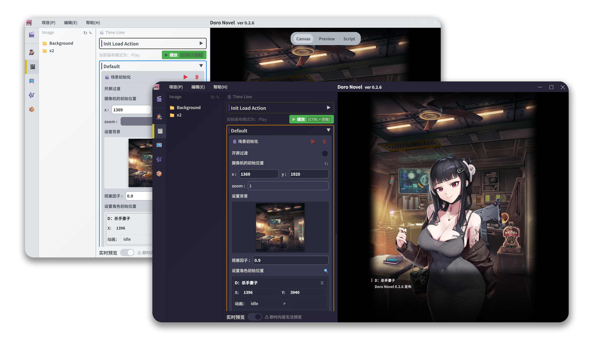

<h1 align="center">
  
  <br>
  Doro Novel
  <br>

</h1>

<h3 align="center">
  <p align="center">
    <small align="center">
      简体中文 | 
      <a href="./docs/en-US/README.md">English</a> | 
      <a href="./docs/ja-JP/README.md">日本語</a> | 
      <a href="./docs/ko-KR/README.md">한국어</a>
    </small>
  </p>
🎨 一个基于 <a href="https://github.com/tauri-apps/tauri">Tauri</a> 可视化小说编辑器，专为创建 Nikke 风格的交互式视觉小说 而设计，支持可视化编辑、剧情分支、多语言本地化 和 实时预览
</h3>

## 预览



<p align="center">
  <a href="https://github.com/NotFaceGUI/doro-novel/releases/latest">
    <strong>下载最新版本</strong>
  </a>
</p>

## 使用指南

### 📦 下载与安装

1. **下载应用程序**
   - 访问 [Releases 页面](https://github.com/NotFaceGUI/doro-novel/releases/latest)
   - 根据您的操作系统下载对应版本：
     - Windows: `doro-novel_x.x.x_x64-setup.exe`
     - macOS: `doro-novel_x.x.x_x64.dmg`
     - Linux: `doro-novel_x.x.x_amd64.AppImage`

2. **安装应用程序**
   - Windows: 双击 `.exe` 文件，按照安装向导完成安装
   - macOS: 打开 `.dmg` 文件，将应用拖拽到 Applications 文件夹
   - Linux: 给 `.AppImage` 文件添加执行权限后直接运行

### 🎮 开始使用

1. **启动应用程序**
   - 首次启动会显示欢迎界面和使用指南

2. **文件关联**
   - 应用程序支持 `.doro`、`.Doro`、`.DORO` 格式的项目文件
   - 安装后可以直接双击这些文件打开项目

3. **资源管理**
   
   应用程序的资源文件位于 `resources` 文件夹下，包含以下目录：
   
   - **📁 audio** - 音频资源文件夹
     - 存放背景音乐、音效等音频文件
   
   - **📁 character** - 角色资源文件夹
     - 包含不同角色的Spine文件

     ---
     ### 🚀 自动更新角色资源脚本
     
     为了方便获取最新的角色资源，我们提供了跨平台的自动更新脚本：
     
     #### Windows 用户
     ```powershell
     # 在 应用程序安装目录 下执行
     .\update_l2d.ps1
     ```
     
     #### Mac 用户
     ```bash
     # 在 应用程序安装目录下执行
     ./update_l2d_mac.sh
     ```
     
     #### Linux 用户
     ```bash
     # 在 应用程序安装目录 下执行
     ./update_l2d_linux.sh
     ```
     
     #### 脚本功能说明
     
     这些脚本会自动执行以下操作：
     
     1. **检查Git环境**
        - Windows: 自动下载并解压 MinGit 便携版（约 45MB）
        - Mac/Linux: 检查系统Git安装，提供安装指导
     
     2. **克隆/更新资源仓库**
        - 从 [Nikke-db/Nikke-db.github.io](https://github.com/Nikke-db/Nikke-db.github.io) 克隆最新的L2D资源
        - 如果已存在则执行 `git pull` 更新到最新版本
     
     3. **智能文件同步**
        - 比较源仓库的 `l2d` 目录与本地 `resources/character` 目录
        - 只复制缺失的文件，避免重复下载
        - 保持目录结构完整
     
     4. **下载内容**
        - 各角色的 Spine 动画文件（.skel, .atlas, .png）
        - 角色立绘和表情资源
        - 预计总大小：3GB+（取决于角色数量）
     
     #### 🙏 致谢
     
     特别感谢 [Nikke-db](https://github.com/Nikke-db) 团队维护的开源资源仓库 [Nikke-db.github.io](https://github.com/Nikke-db/Nikke-db.github.io)，为社区提供了完整的角色资源数据。该仓库包含了游戏中所有角色的高质量 Spine 动画资源，使得本项目能够为用户提供丰富的角色展示功能。
     
     没有他们的无私贡献和持续维护，本项目的角色系统将无法实现如此完整的功能。

     ---
   
   - **📁 image** - 图像资源文件夹
     - 存放背景图片，立绘等
     - `Background` 子文件夹存放背景图片
     - `x2` 子文件夹存放高分辨率资源
   
   - **📁 locales** - 多语言文件夹
     - 支持中文 `zh-CN`、英文 `en-US`、日文 `ja-JP`、韩文 `ko-KR`
   
   - **📁 package** - 打包资源文件夹
     - 包含着色器等特殊资源文件
     - 或是一些json详细详细
   
   - **📁 video** - 视频资源文件夹
     - 存放动画视频文件
   
   - **📄 spine-character.json** - Spine 角色配置文件
     - 定义角色动画和骨骼信息

### 💡 使用技巧

- 支持拖拽导入资源文件
- 可以实时预览 Spine 动画效果
- 支持多语言界面切换
- 内置资源管理器便于文件组织（feature）


## 快速开始

> 先决条件

- 确保您的系统满足 [Tauri 要求](https://tauri.app/v1/guides/getting-started/prerequisites)
- 安装 [pnpm](https://pnpm.io/installation) 包管理器
- 想要开始使用或贡献代码？请查看我们的 [贡献指南](CONTRIBUTING.md) 获取详细的环境设置和开发说明。

```bash
git clone https://github.com/NotFaceGUI/doro-novel.git
cd doro-novel

pnpm install

pnpm postinstall

pnpm tauri dev `or` pnpm tauri build
```

## 贡献

我们欢迎所有形式的贡献！请查看 [CONTRIBUTING.md](CONTRIBUTING.md) 了解详细的贡献指南。

## 许可证

本项目采用 MIT 许可证 - 查看 [LICENSE](LICENSE) 文件了解详情。

## 致谢

- [Tauri](https://tauri.app/) - 跨平台桌面应用框架
- [Vue.js](https://vuejs.org/) - 渐进式 JavaScript 框架
- [PixiJS](https://pixijs.com/) - 2D 渲染引擎
- [Spine](http://esotericsoftware.com/) - 2D 骨骼动画工具

## 免责声明

> **⚠️ 重要提示：请仔细阅读以下条款**

### 使用目的
- 本软件**仅供学习、研究和技术交流使用**
- **严禁用于任何商业用途**或盈利活动
- 旨在促进开源社区的技术发展和知识共享

### 资源来源
- 所有资源均来自**公开可访问的渠道**
- 本软件本身**不包含、不分发任何形式的游戏解包内容**
- 用户需**自行**获取资源文件

### 法律责任
- 用户使用本软件时**必须遵守所在地区的法律法规**
- 因使用本软件产生的任何法律问题，**用户需自行承担全部责任**
- 开发者不对用户的使用行为承担任何法律责任

### 知识产权
- 请尊重原作品的**版权和知识产权**
- 如涉及第三方内容，请确保已获得**合法使用授权**
- 本项目遵循开源协议，但不代表其引用的第三方资源同样开源