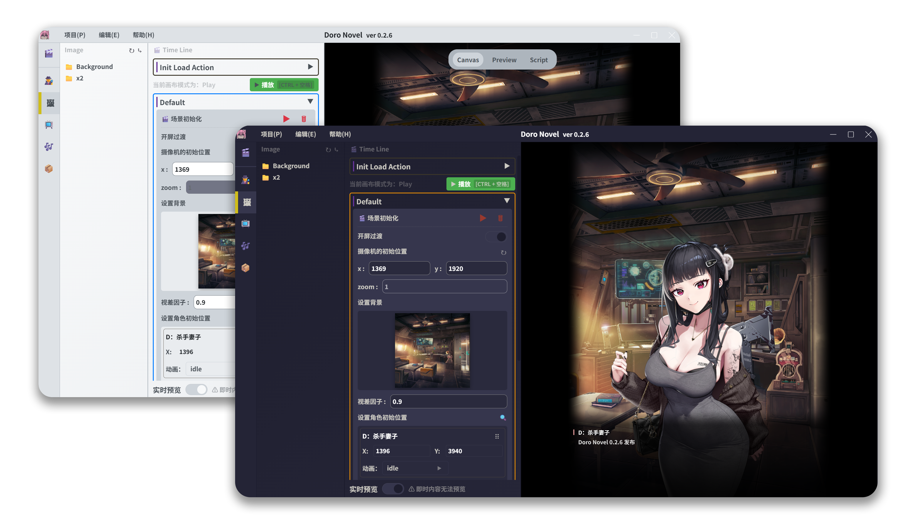

<h1 align="center">
  
  <br>
  Doro Novel
  <br>

</h1>

<h3 align="center">
  <p align="center">
    <small align="center">
      <a href="../../README.md">简体中文</a> | 
      <a href="../en-US/README.md">English</a> | 
      <a href="../ja-JP/README.md">日本語</a> | 
      한국어
    </small>
  </p>
🎨 <a href="https://github.com/tauri-apps/tauri">Tauri</a> 기반의 비주얼 노벨 편집기로, Nikke 스타일의 인터랙티브 비주얼 노벨 제작을 위해 설계되었습니다. 시각적 편집, 스토리 분기, 다국어 현지화 및 실시간 미리보기를 지원합니다.
</h3>

## 미리보기



<p align="center">
  <a href="https://github.com/NotFaceGUI/doro-novel/releases/latest">
    <strong>최신 버전 다운로드</strong>
  </a>
</p>

> ⚠️ 본 문서는 AI로 번역된 내용입니다.  
부적절하거나 어색한 표현이 있다면 알려주시거나 직접 수정해 주시기 바랍니다.

## 사용 가이드

### 📦 다운로드 및 설치

1. **애플리케이션 다운로드**
   - [릴리스 페이지](https://github.com/NotFaceGUI/doro-novel/releases/latest) 방문
   - 운영체제에 맞는 버전 다운로드:
     - Windows: `doro-novel_x.x.x_x64-setup.exe`
     - macOS: `doro-novel_x.x.x_x64.dmg`
     - Linux: `doro-novel_x.x.x_amd64.AppImage`

2. **애플리케이션 설치**
   - Windows: `.exe` 파일을 더블클릭하고 설치 마법사를 따라 설치
   - macOS: `.dmg` 파일을 열고 앱을 Applications 폴더로 드래그
   - Linux: `.AppImage` 파일에 실행 권한을 추가하고 직접 실행

### 🎮 시작하기

1. **애플리케이션 실행**
   - 첫 실행 시 환영 화면과 사용 가이드가 표시됩니다

2. **파일 연결**
   - 애플리케이션은 `.doro`, `.Doro`, `.DORO` 형식의 프로젝트 파일을 지원
   - 설치 후 이러한 파일을 더블클릭하여 프로젝트를 열 수 있습니다

3. **리소스 관리**
   
   애플리케이션의 리소스 파일은 `resources` 폴더에 위치하며, 다음 디렉토리를 포함합니다:
   
   - **📁 audio** - 오디오 리소스 폴더
     - 배경음악, 효과음 등의 오디오 파일 저장
   
   - **📁 character** - 캐릭터 리소스 폴더
     - 여러 캐릭터가 포함된 Spine 파일 (상세 튜토리얼)
   
   - **📁 image** - 이미지 리소스 폴더
     - 배경 이미지, 캐릭터 일러스트 등을 저장
     - `Background` 하위 폴더에는 배경 이미지를 저장
     - `x2` 하위 폴더에는 고해상도 리소스를 저장
   
   - **📁 locales** - 다국어 폴더
     - 중국어 `zh-CN`, 영어 `en-US`, 일본어 `ja-JP`, 한국어 `ko-KR` 지원
   
   - **📁 package** - 패키지 리소스 폴더
     - 셰이더 등 특수 리소스를 포함
     - 또는 일부 상세 JSON 파일
   
   - **📁 video** - 비디오 리소스 폴더
     - 애니메이션 비디오 파일 저장
   
   - **📄 spine-character.json** - Spine 캐릭터 설정 파일
     - 캐릭터 애니메이션 및 스켈레탈 정보 정의

### 💡 사용 팁

- 리소스 파일의 드래그 앤 드롭 가져오기 지원
- Spine 애니메이션 효과의 실시간 미리보기 가능
- 다국어 인터페이스 전환 지원
- 파일 정리에 편리한 내장 리소스 매니저

## 빠른 시작

> 전제 조건

- 시스템이 [Tauri 요구사항](https://tauri.app/v1/guides/getting-started/prerequisites)을 충족하는지 확인
- [pnpm](https://pnpm.io/installation) 패키지 매니저 설치
- 시작하거나 코드에 기여하고 싶으신가요? 자세한 환경 설정 및 개발 지침은 [기여 가이드](../../CONTRIBUTING.md)를 확인하세요.

```bash
git clone https://github.com/NotFaceGUI/doro-novel.git
cd doro-novel

pnpm install
pnpm postinstall
pnpm tauri dev # 또는 pnpm tauri build
```

## 기여

모든 형태의 기여를 환영합니다! 자세한 기여 가이드라인은 [CONTRIBUTING.md](../../CONTRIBUTING.md)를 확인하세요.

## 라이선스

이 프로젝트는 MIT 라이선스 하에 라이선스됩니다 - 자세한 내용은 [LICENSE](../../LICENSE) 파일을 참조하세요.

## 감사의 말

- [Tauri](https://tauri.app/) - 크로스 플랫폼 데스크톱 애플리케이션 프레임워크
- [Vue.js](https://vuejs.org/) - 프로그레시브 JavaScript 프레임워크
- [PixiJS](https://pixijs.com/) - 2D 렌더링 엔진
- [Spine](http://esotericsoftware.com/) - 2D 스켈레탈 애니메이션 도구